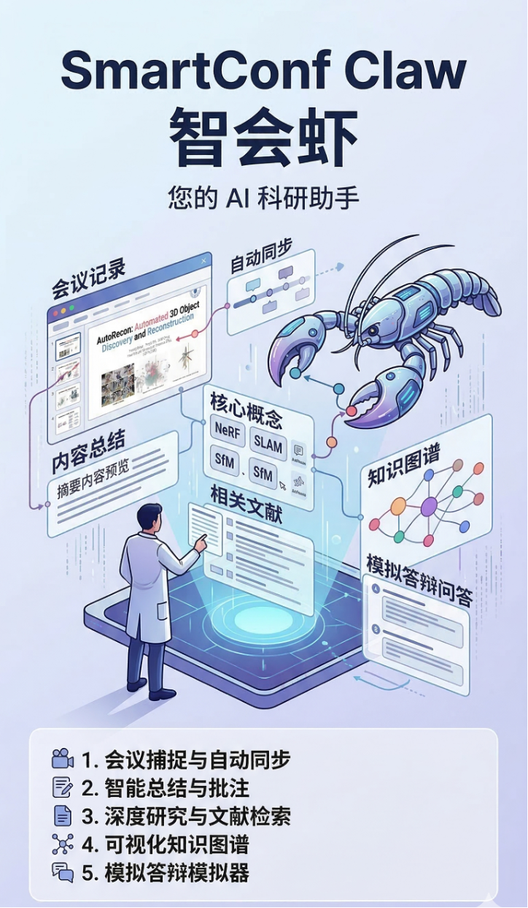

# SmartConf Claw (学术领航虾)

> A bilingual desktop AI academic copilot built for the OpenClaw Agent Hackathon.
>
> Your AI Academic Co-Pilot.

## Overview / 概览

SmartConf Claw is a desktop AI assistant for online academic conferences. It lets you select a screen region, captures presentation content, transcribes audio (ASR), then generates structured summaries, key concepts, knowledge graphs, and PhD-style Q&A practice.

智会虾（SmartConf Claw）是一个面向线上学术会议的桌面端 AI 助手。你只需要选择屏幕区域，它会捕获演示内容、完成语音转写（ASR），并自动生成结构化总结、关键概念、知识图谱以及博士面试/答辩风格的问答训练题。

## Demo Video / 演示视频

- [Bilibili: SmartConfClaw 智会虾：基于OpenClaw的多模态会议助手](https://www.bilibili.com/video/BV18HA5zjEaY/)
- [SmartConf Claw Demo: Your AI Academic Co-Pilot](https://youtu.be/AK2FVnlIMCk)

## Documentation / 说明文档

- [Notion: SmartConf-Claw（说明）](https://necessary-beast-2f1.notion.site/SmartConf-Claw-3268e8c2bbba80a1bab6ea2f68c4b42b?source=copy_link)

## Screenshot Gallery / 截图展示

### Meeting Capture / 会议捕获

中文：选择截屏区域后自动捕获 PPT 画面，并与音频转写进行时间对齐。

English: After selecting a region, it captures presentation slides and aligns them with the audio transcript.

### AI Analysis / AI 分析

中文：基于转写文本 + 截图进行总结、概念解析、标签抽取与结构化输出。

English: Analyze both transcript text and screenshots to produce summaries, concept explanations, tags, and structured outputs.

### Related Papers & Articles / 相关论文与文章

中文：根据会议内容，自动生成相关顶会论文/公众号文章列表，便于延伸阅读。

English: Automatically compile related papers/articles based on the session for deeper reading.

### Knowledge Graph / 知识图谱

中文：把跨会话的内容要素（方法、数据集、指标、作者等）抽取并可视化为可点击知识图谱。

English: Extract and visualize entities across sessions into a clickable knowledge graph.

### Q&A Simulator / Q&A 模拟器

中文：把被动听会变成主动训练，生成面试/答辩风格的问题，并给出建议回答要点。

English: Turn passive listening into active practice with PhD-style questions and suggested answer points.

### Flexible Settings / 灵活设置

中文：可配置截屏频率、转写与分析相关行为，让捕获更贴合你的会议节奏。

English: Configure capture interval and related analysis behavior to match your conference rhythm.

## Key Features / 核心功能

- Smart Capture & Auto-Sync: 选择截屏区域，自动对齐 PPT 截图与实时音频转写（ASR）。
- Summaries & Key Concepts: 总结章节要点，并提炼复杂学术概念，提供可悬浮查看的解释。
- Related Literature Retrieval: 基于会议内容检索相关论文/文章，支持延伸阅读清单。
- Interactive Knowledge Graph: 将跨会话内容结构化并渲染为知识图谱。
- Q&A Simulator: 生成博士面试/答辩问题，帮助你快速形成答题框架。
- Privacy-first workflow: 本地侧能力支持（如本地 ASR / 本地推理），尽量降低数据外泄风险。

## Tech Stack / 技术栈

- Frontend: React 18, TypeScript, TailwindCSS, shadcn/ui
- Desktop Core: Tauri 2.0 (Rust)
- Visualization: React Flow
- State Management: Zustand

## Getting Started / 快速开始

1. Install dependencies: `npm install`
2. Start in dev mode: `npm run tauri dev`

### Full-screen Space & background capture / 全屏桌面与后台捕获

- **English:** On macOS, a **full-screen app** lives on its own **Space** (the extra “desktop” you see in Mission Control). The app’s **Full-screen desktop (per monitor)** mode captures a **physical monitor**—whatever pixels are **currently visible** on that screen (including that full-screen Space). It is **not** a separate API for “this Space only in the background”: if you switch to another Space on the **same** monitor, the recording shows that Space. For **slides on one screen + work on another**, use **two displays** and choose the monitor that shows the full-screen presentation.
- **中文：** macOS 全屏应用会进入**独立桌面（Space）**，也就是调度中心里多出来的那一页。应用里的 **全屏桌面（按显示器）** 是按**物理显示器**定时截屏：录到的是该显示器**当前画面上**的内容（包括全屏时的那一页）。**不能**在系统层面单独“只录某个隐藏 Space、你却在同一屏上干别的活”；若在同一显示器上切换桌面，画面会跟着变。若需要「一屏全屏放幻灯片、另一屏做笔记」，请使用**双显示器**，并选择放演示的那一屏。

### macOS system audio (loopback) / macOS 系统内录

- **English:** macOS cannot capture “what the speakers play” without a virtual loopback device. Install something like [BlackHole](https://github.com/ExistentialAudio/BlackHole), set **System Settings → Sound → Output** to BlackHole, then refresh the audio device list in **Settings** — the device appears under **System audio (loopback)** and can be mixed with your mic.
- **中文：** macOS 不能像 Windows 那样直接立体声混音内录。请安装虚拟声卡（如 [BlackHole](https://github.com/ExistentialAudio/BlackHole)），在「系统设置 → 声音」将输出设为 BlackHole，再在应用「设置」里刷新音频设备列表，即可在「系统内录」中勾选，并可与麦克风同时混音。

如果你已经完成本地配置与密钥填写，打开应用后：
1) 在“Meeting Capture”选择区域开始捕获  
2) 完成转写与 AI 分析后查看总结/概念/知识图谱/问答  

## License / 许可协议

MIT License. See `LICENSE` for details.
